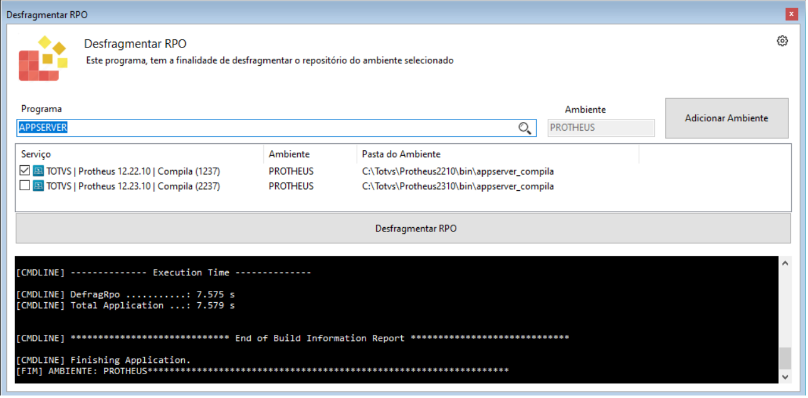

# Desfragmentação RPO

Exemplo:

c:\totvs\protheus\bin\appserver\appserver.exe -console -compile -defragrpo -env=NomeAmbiente

Parametros:

<pre>
-compile	Inicialização da ferramenta.
-defragrpo	Indica desfragmentação de RPO.
-env	        Informa o ambiente que deverá ser desfragmentado.
</pre>

